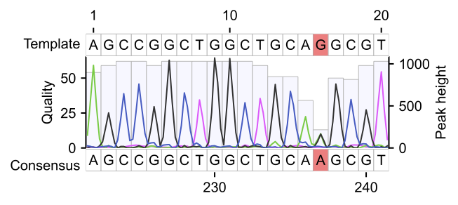

# PySanger Installation and User Manual
Sanger sequencing is an important method to validate nucleotide sequences in synthetic DNA parts.  In current biology, confirming over a few dozen Sanger sequencing results is a general task. However, there is no software to check a large number of Sanger sequencing results with script-based tools. As a result, biologists consume their time to check the results with point-and-click on the screen.  
BioPython provides a parser to interpret Sanger sequencing results (abi format file). However, the usage explanation is insufficient; it is too difficult to understand how to use the parser.  
Here, I provide a Python module to interpret the Sanger sequencing result. With a simple python script, users can easily extract the expected sequence detected by Sanger sequencing or map the observed signal intensities on the expected ideal sequences. You no longer need to use GUI-based software such as Ape, SnapGene, and Benchling for checking Sanger sequencing results.  

## Software dependency
- python 3.8.0 or later

## Installation
1.  Download the software by  ````git clone https://github.com/yachielab/dna.py ````
2.  Install the following Python packages by  
	
	```
	pip install matplotlib
	pip install numpy
	pip install biopython
	pip install pandas
	pip install logomaker (optional) 
	```

3.  Set PYTHONPATH to the directory where you cloned the repository.

## API
- **abi_to_dict**_`(filename=str)`_  
	Generate confidence value array and signal intensity arrays of each channel (A, T, G or C) at peak positions. 
	
	**Parameter**
	
	- **filename**: *`str`*  (default: None)  
	A file path of sanger sequencing result.   
	
	**Return**
	_dict_
	``` 
	{"conf": quality scores at peak positions.
	 "channel":{"A": signal intensities at peak positions in the channel for 'A',
	            "T": signal intensities at peak positions in the channel for 'T',
	            "G": signal intensities at peak positions in the channel for 'G',
	            "C": signal intensities at peak positions in the channel for 'C'}
	}
	```

- **generate_consensusseq**_`(abidata=dict)`_
	Generate the most consensus seq from a senger sequencing result.  

	**Parameter**
	
	- **abidata**: *`dict`*  (default: None)  
	A dict object returned by 'abi_to_dict'.   
	
	**Return**
	_tuple_
	`(str:Forward strand sequence (5'->3'), str:Reverse strand sequence (5'->3'))` 

- **generate_pwm**_`(abidata=dict)`_
	Generate position weight matrix based on signal intensities of each channel.   
	
	**Parameter**
	
	- **abidata**: *`dict`*  (default: None)  
	A dict object returned by 'abi_to_dict'.   

	**Return**
	_pandas.DataFrame_

- **visualize**_`(abidata=dict, query=str, strand=int, fig=matplolib.pyplot.figure)`_ 
	Visualize a sanger sequencing result. 
	
	**Parameter**  	
	
	- **abidata**: *`dict`*  (default: None)  
	A dict object returned by 'abi_to_dict'.   
	- **query**: *`str`*  (default: None)  
	If `query` is `None` or not given, the function will visualize sequence intensities of each channel at peak postion.   
	If `query` is a nucleotide sequence, it will be aligned with the consensus sequence generated by `generateconsensusseq`. The alignment result will be displayed in the visualization. 
	- **strand**: *`str`* (1 or -1, default: 1) 
	A sequencing strand used for the alignment and visualization. `1` indicates the plus strand. `-1` indicates the minus strand. 
	- **region**: *`str`* ("all" or "aligned", default: "all")
	A region used for the visualization. If `all`, it will visualize the entire region of the Sanger sequencing result. If `aligned`, it will visualize only the sequence region aligned with the `template`.
	- **fig**: *`matplolib.pyplot.figure`* (fig, default: None)
	If `fig` is `None` or not given, a figure object will be generated for the viualization.   
 	If `fig` is `matplolib.pyplot.figure` object, the figure object will be used for the viualization.
	
	**Return**
	_matplolib.pyplot.figure_


## Example usage 
Visualise peck intensities from a Sanger sequencing result. I used `BE MAFB5.ab1` as test data for the demonstration. It can be downloded from `https://github.com/MoriarityLab/EditR/tree/master/testfiles`.   


```python
from pysanger import * 
abidata    = abi_to_dict(sys.argv[1])  
fseq, rseq = generate_consensusseq(abidata)  
fig        = visualize(abidata, template="AGCCGGCTGGCTGCAGGCGT", region="aligned") 
fig.savefig("test.pdf", bbox_inches="tight") 
```



## Example usage 2
Create motif logo from a Sanger sequencing reuslt. (To execute the example, [logomaker](https://logomaker.readthedocs.io/en/latest/) module is required) 

```python
from pysanger import *
import regex as re 
import matplotlib.pyplot as plt 
import logomaker

pwm        = generate_pwm(abidata) 
fseq, rseq = generate_consensusseq(abidata) 

match = re.search("(AGCCGGCTGGCTGCAGGCGT){e<=1}", fseq.upper())
s,e   = match.span()

fig = plt.figure(figsize=(0.25,1))
ax  = fig.add_axes([0.1, 0.1, e-s, 0.75])
pwm = logomaker.transform_matrix(pwm.iloc[s:e, :], from_type="counts", to_type="probability")

logo = logomaker.Logo(pwm,
    font_name='Helvetica',
    color_scheme='classic',
    vpad=.0,
    width=.8,
    ax=ax)

    ax.set_xticks([]) 
fig.savefig("test_logo.pdf", bbox_inches="tight") 
```

